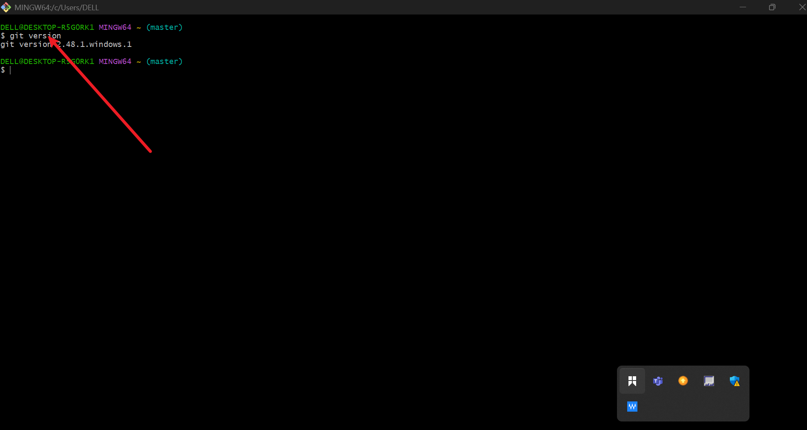
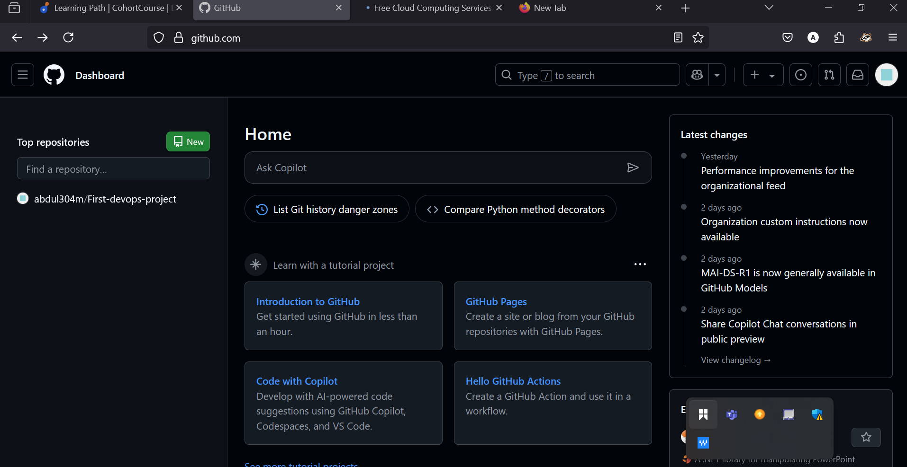
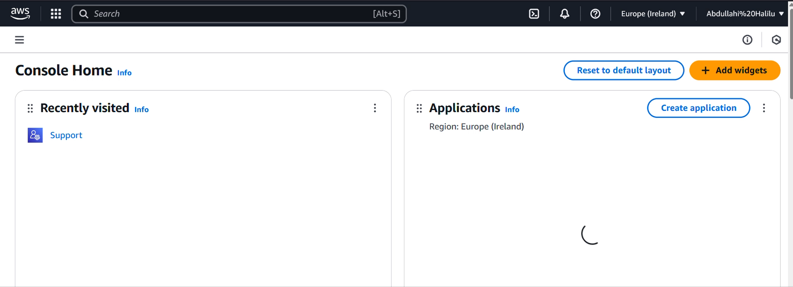
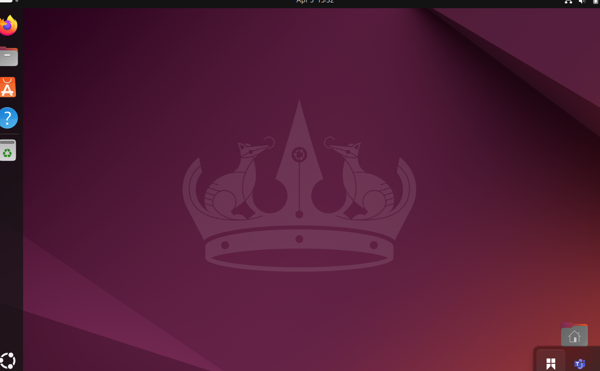

# First-devops-project

In this project we will be implementing some of the pictures of the tools used by Devops engineer while implementing amd documenting his project.

## 1. Install Git bash 

This is the picture of Gitbash interface. To verify that Git is installed we type "Git version"

## 2. install virtual studio code 

This is the picture of installed virtual studio code interface that engineer also use for documentation.

## 3. Github Account.

This is the picture of github account that engineer use to store, share, and work togather with others to write code.

## 4. Aws Account 

This is also a picture of Aws root account which has virually unlimitted access to all programs, files, and resources on a system.

## 5. Ubuntu 

This is the picture of ubuntu interface which is linux distro based on Debian. its suitable for cloud computing, servers, desktops, and internet of thigs devices.

## 6. vitual Box(For running ubuntu)

This is the picture of virtual box for running ubuntu. 

.png)